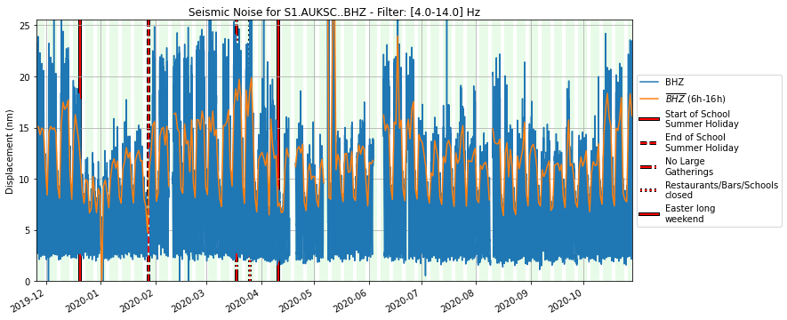
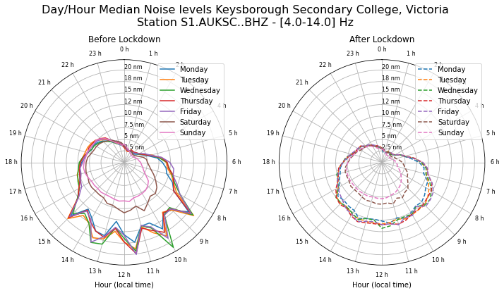
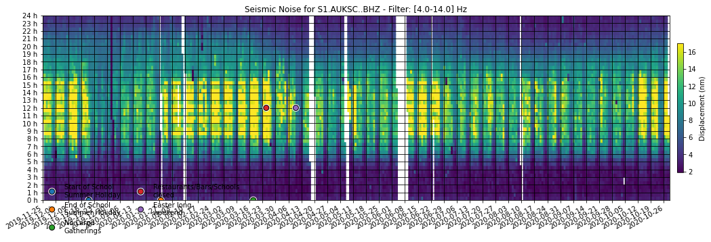
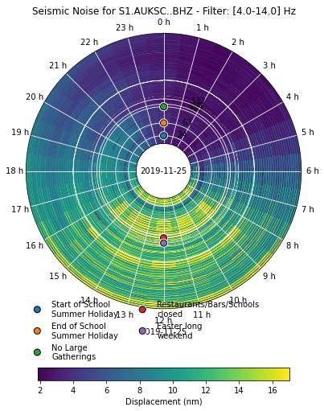

<!-- #region -->
# Ground Motion Displacement RMS vs Time


This repository is a self-updating version of the [seismic social-distancing "monitoring" toolkit](link) of Thomas Lecocq Fred Massin and Claudio Satriano. The notebook software is bundled with some code that triggers github actions to download any new data and update the images in this README file.

This example is from the Blah Blah location / AuSIS 

If you want to try it, fork the template repository and follow the instructions.
<!-- #endregion -->

## Classic plot



## Hourly plot



## Gridmap plot



## Hourmap plot




```python

```
